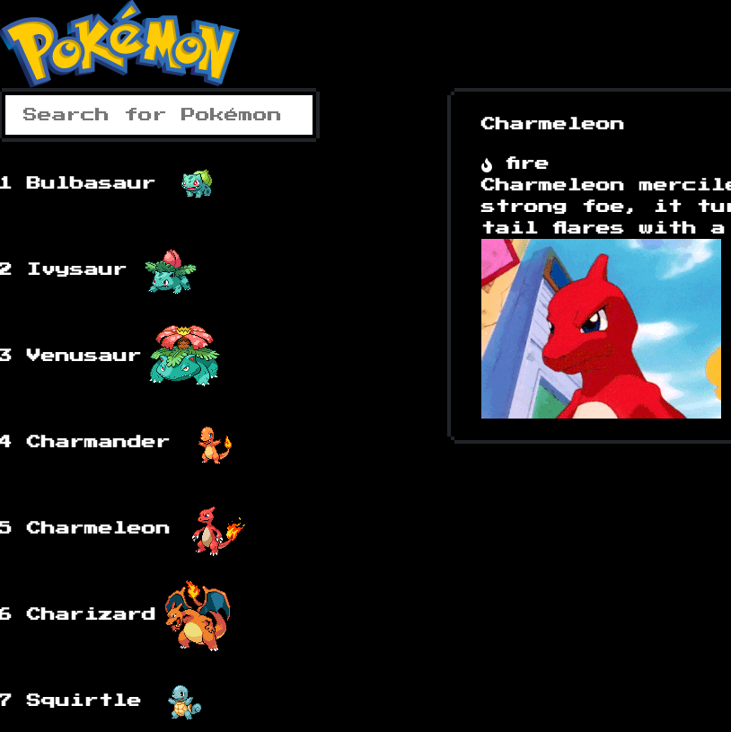

# pokedex

pokédex built with data from poke-API in Vanilla Javascript

Giphies are retrieved from the [Giphy API](https://developers.giphy.com/)

You can see the live version [here:](https://littlemousey.github.io/pokedex/)

